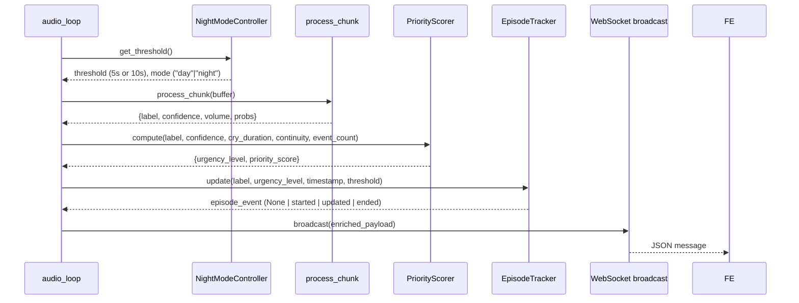
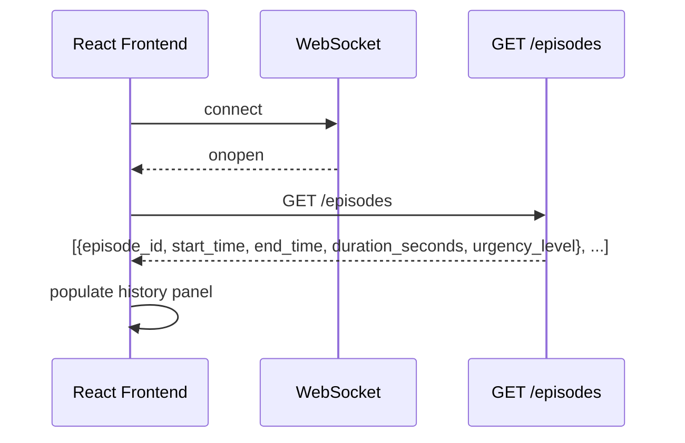
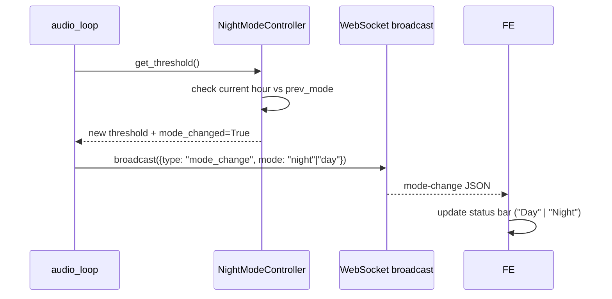

# Design Document: Cry Intelligence Features

## Overview

This document describes the technical design for three intelligence layers added on top of the existing CRYGUARD system ("שומר הבית / Guardian Aura"): a **Priority Scorer** that assigns urgency levels to each cry detection, an **Episode Tracker** that groups consecutive detections into summarised cry episodes, and a **Night Mode Controller** that adapts alert thresholds based on the local time of day. A unified history panel in the React frontend ties all three layers together.

The existing system's `backend/main.py` runs a continuous `audio_loop()` that feeds audio chunks through a Keras model and broadcasts JSON results over WebSocket. All three new modules plug into that loop without replacing it, and the frontend receives both real-time WebSocket events and historical data fetched from a new REST endpoint.

---

## Architecture

```mermaid
graph TD
    MIC[Microphone InputStream]
    AL[audio_loop in main.py]
    PC[process_chunk]
    NMC[NightModeController]
    PS[PriorityScorer]
    ET[EpisodeTracker]
    EP[/episodes REST endpoint]
    WS[WebSocket broadcast]
    FE[React Frontend]

    MIC -->|audio chunks| AL
    AL --> NMC
    NMC -->|current threshold| AL
    AL --> PC
    PC -->|label + confidence + volume| PS
    PS -->|urgency_level + priority_score| ET
    ET -->|episode lifecycle events| WS
    PS -->|enriched detection payload| WS
    NMC -->|mode-change event| WS
    WS -->|JSON messages| FE
    ET -->|completed episodes list| EP
    FE -->|GET /episodes on load/reconnect| EP
```

---

## Sequence Diagrams

### Detection Cycle (per audio chunk)



### Frontend Load / Reconnect



### Night Mode Transition



---

## Components and Interfaces

### Component 1: NightModeController (`backend/night_mode.py`)

**Purpose**: Determines whether the system is in Day Mode or Night Mode at any moment, returns the applicable `Alert_Threshold`, and signals when a transition occurs.

**Interface**:

```python
class NightModeController:
    def __init__(self) -> None:
        """
        Reads NIGHT_MODE_START_HOUR and DAY_MODE_START_HOUR from environment.
        Falls back to defaults (22, 7) and logs a warning on invalid values.
        """

    def get_mode(self) -> str:
        """
        Returns "night" if the current local hour is in [night_start, 24) ∪ [0, day_start),
        otherwise "day".
        """

    def get_threshold(self) -> int:
        """
        Returns 5 (seconds) when in Night_Mode, 10 (seconds) when in Day_Mode.
        """

    def check_transition(self) -> str | None:
        """
        Compares current mode against last known mode.
        Returns "night" or "day" if a transition just occurred, None otherwise.
        Resets internal cry-accumulation state on transition.
        """
```

**Responsibilities**:
- Parse `NIGHT_MODE_START_HOUR` / `DAY_MODE_START_HOUR` env vars; fall back to 22 / 7 on error and log.
- Evaluate local time each call (no caching — allows real-time transitions).
- Emit transition signal at most once per mode boundary crossing.

---

### Component 2: PriorityScorer (`backend/priority_scorer.py`)

**Purpose**: Computes a numeric priority score (0–100) and maps it to an `Urgency_Level` enum from four equally-weighted inputs.

**Interface**:

```python
from enum import Enum

class UrgencyLevel(str, Enum):
    LOW      = "low"
    MEDIUM   = "medium"
    HIGH     = "high"
    CRITICAL = "critical"

class PriorityScorer:
    def compute(
        self,
        cry_duration_sec: float,    # seconds of continuous crying so far
        continuity_ratio: float,    # fraction of last 10 chunks classified as crying [0.0, 1.0]
        event_count_60s:  int,      # distinct cry events in the last 60 seconds
        confidence_score: float,    # model confidence for crying class [0.0, 100.0]
    ) -> tuple[UrgencyLevel, float]:
        """
        Returns (urgency_level, priority_score).
        priority_score is in [0, 100] and is deterministic for identical inputs.
        """
```

**Responsibilities**:
- Normalise each input to a 0–100 scale (see Data Models section for normalisation ranges).
- Average the four normalised values to produce `priority_score`.
- Map score to `UrgencyLevel` using non-overlapping, exhaustive ranges.
- Only called when the model label is `"crying"`.

---

### Component 3: EpisodeTracker (`backend/episode_tracker.py`)

**Purpose**: Manages the lifecycle of a single cry episode (idle → active → ended) and maintains an in-memory list of completed episodes capped at 100 entries.

**Interface**:

```python
from dataclasses import dataclass
from typing import Optional

@dataclass
class CryEpisode:
    episode_id:       str           # uuid4 string
    start_time:       str           # ISO 8601, local time
    end_time:         Optional[str] # ISO 8601, local time; None while active
    duration_seconds: int           # floor(end - start) in seconds
    urgency_level:    str           # UrgencyLevel value

class EpisodeTracker:
    def __init__(self) -> None: ...

    def update(
        self,
        label:         str,          # "crying" | "background"
        urgency_level: Optional[str],# UrgencyLevel value, or None if not crying
        timestamp:     float,        # time.time() value
        threshold_sec: int,          # current Alert_Threshold from NightModeController
        calm_chunks:   int,          # consecutive non-crying chunks so far
        calm_threshold: int,         # chunks needed to confirm calm (maps to CALM_WINDOW)
    ) -> Optional[dict]:
        """
        Drives the episode state machine.
        Returns an episode-summary dict when an episode ends, otherwise None.
        The returned dict matches the CryEpisode fields plus type="episode_end".
        """

    def get_episodes(self) -> list[dict]:
        """
        Returns completed episodes in reverse chronological order (most recent first).
        """

    def close_active(self, shutdown_time: float) -> None:
        """
        Called on system shutdown. Closes any in-progress episode with shutdown_time
        as end_time and appends it to the completed list.
        """
```

**Responsibilities**:
- Track whether an episode is currently active.
- Use `threshold_sec` to decide when to open an episode (consecutive crying seconds ≥ threshold).
- Record peak `UrgencyLevel` across all chunks in the episode.
- Update `duration_seconds` on every chunk while active.
- Enforce 100-episode cap by discarding the oldest entry when exceeded.
- Call `close_active()` in the FastAPI `shutdown` lifecycle event.

---

### Component 4: Updated `audio_loop` in `backend/main.py`

**Purpose**: Integrates the three new modules into the existing detection pipeline.

The following additions are made inside `audio_loop()`:

```python
# Instantiated once at module level
night_mode_ctrl = NightModeController()
priority_scorer = PriorityScorer()
episode_tracker = EpisodeTracker()

# Inside the loop, after process_chunk():
threshold  = night_mode_ctrl.get_threshold()
transition = night_mode_ctrl.check_transition()
if transition:
    await broadcast({"type": "mode_change", "mode": transition})
    cry_seconds = 0  # reset accumulation counter

result["threshold"] = threshold

if result["label"] == "crying":
    urgency, score = priority_scorer.compute(
        cry_duration_sec = cry_seconds,
        continuity_ratio = continuity_ratio,
        event_count_60s  = event_count_60s,
        confidence_score = result["confidence"],
    )
    result["urgency_level"]  = urgency.value
    result["priority_score"] = round(score, 1)

episode_event = episode_tracker.update(
    label          = result["label"],
    urgency_level  = result.get("urgency_level"),
    timestamp      = time.time(),
    threshold_sec  = threshold,
    calm_chunks    = calm_chunks,
    calm_threshold = CALM_WINDOW,
)

await broadcast(result)

if episode_event:
    await broadcast({**episode_event, "type": "episode_end"})
```

---

### Component 5: Updated React Frontend (`frontend/src/App.js`)

**Purpose**: Displays urgency level in alerts and events, renders the unified episode history panel, and updates the status bar for Night/Day Mode.

New state variables and refs:

```javascript
const [episodes,    setEpisodes]    = useState([]);   // fetched from /episodes
const [currentMode, setCurrentMode] = useState(null); // "day" | "night" | null
```

New WebSocket message handling (added to `socket.onmessage`):

```javascript
if (data.type === "mode_change") {
  setCurrentMode(data.mode);
  return;
}

if (data.type === "episode_end") {
  setEpisodes(prev => [data, ...prev].slice(0, 100));
  return;
}

// Existing alert logic — unchanged
// Additionally, when label is "crying", attach urgency_level to event entry:
if (!inAlertRef.current && cryHits >= CRY_MIN_HITS) {
  setEvents(prev => [
    { type: "cry", text: "בכי זוהה", time: t, urgency: data.urgency_level },
    ...prev.slice(0, 19),
  ]);
}
```

`/episodes` fetch on load and reconnect (inside `socket.onopen`):

```javascript
fetch(`${API_URL}/episodes`, { headers: { "X-API-Key": API_KEY } })
  .then(r => r.ok ? r.json() : Promise.reject())
  .then(data => setEpisodes(data))
  .catch(() => {});
```

---

## Data Models

### UrgencyLevel Enum

| Value | Priority Score Range |
|-------|---------------------|
| `low` | [0, 25) |
| `medium` | [25, 50) |
| `high` | [50, 75) |
| `critical` | [75, 100] |

### Priority Score Normalisation

Each of the four inputs is normalised to a 0–100 scale before averaging:

| Input | Normalisation | Cap |
|-------|--------------|-----|
| `cry_duration_sec` | `min(duration / 60, 1) * 100` | 60 s → 100 |
| `continuity_ratio` | `ratio * 100` | already [0, 1] |
| `event_count_60s` | `min(count / 5, 1) * 100` | 5 events → 100 |
| `confidence_score` | already [0, 100] | — |

`priority_score = (norm_duration + norm_continuity + norm_event_count + confidence_score) / 4`

### CryEpisode (REST + WebSocket payload)

```python
{
    "episode_id":       "550e8400-e29b-41d4-a716-446655440000",  # uuid4
    "start_time":       "2025-07-14T02:30:05",                   # ISO 8601 local
    "end_time":         "2025-07-14T02:30:28",                   # ISO 8601 local
    "duration_seconds": 23,                                       # int, floor
    "urgency_level":    "high"                                    # UrgencyLevel
}
```

### Enriched WebSocket Detection Payload (label == "crying")

```python
{
    "label":          "crying",
    "confidence":     82.4,          # float, 0–100
    "alert":          True,
    "volume":         0.312,
    "probs":          {"crying": 82.4, "background": 17.6},
    "urgency_level":  "high",        # NEW
    "priority_score": 61.3,          # NEW
    "threshold":      5              # NEW — current Night/Day threshold
}
```

### Mode-Change WebSocket Payload

```python
{
    "type": "mode_change",
    "mode": "night"   # or "day"
}
```

### Episode-End WebSocket Payload

```python
{
    "type":             "episode_end",
    "episode_id":       "...",
    "start_time":       "...",
    "end_time":         "...",
    "duration_seconds": 23,
    "urgency_level":    "high"
}
```

### GET /episodes Response

```python
[
    {
        "episode_id":       "...",
        "start_time":       "...",
        "end_time":         "...",
        "duration_seconds": 23,
        "urgency_level":    "high"
    },
    ...   # reverse chronological, max 100 items
]
```

---

## Algorithmic Pseudocode

### Priority Score Computation

```pascal
ALGORITHM compute_priority_score(cry_duration_sec, continuity_ratio, event_count_60s, confidence_score)
INPUT:
  cry_duration_sec : float  -- seconds of continuous crying [0, ∞)
  continuity_ratio : float  -- fraction of last 10 chunks that are crying [0.0, 1.0]
  event_count_60s  : int    -- distinct cry events in last 60 s [0, ∞)
  confidence_score : float  -- model confidence [0.0, 100.0]
OUTPUT:
  urgency_level : UrgencyLevel
  priority_score : float in [0, 100]

BEGIN
  norm_duration    ← MIN(cry_duration_sec / 60.0, 1.0) * 100.0
  norm_continuity  ← continuity_ratio * 100.0
  norm_event_count ← MIN(event_count_60s / 5.0, 1.0) * 100.0
  norm_confidence  ← confidence_score  -- already [0, 100]

  priority_score ← (norm_duration + norm_continuity + norm_event_count + norm_confidence) / 4.0

  IF priority_score < 25.0 THEN
    urgency_level ← LOW
  ELSE IF priority_score < 50.0 THEN
    urgency_level ← MEDIUM
  ELSE IF priority_score < 75.0 THEN
    urgency_level ← HIGH
  ELSE
    urgency_level ← CRITICAL
  END IF

  RETURN (urgency_level, priority_score)
END
```

**Preconditions:**
- `cry_duration_sec ≥ 0`
- `continuity_ratio ∈ [0.0, 1.0]`
- `event_count_60s ≥ 0`
- `confidence_score ∈ [0.0, 100.0]`

**Postconditions:**
- `priority_score ∈ [0.0, 100.0]`
- Exactly one `urgency_level` is assigned per score (ranges are non-overlapping and cover [0, 100])
- Function is pure and deterministic

---

### Episode State Machine

```pascal
ALGORITHM episode_tracker_update(label, urgency_level, timestamp, threshold_sec, calm_chunks, calm_threshold)
INPUT:
  label          : string  -- "crying" or "background"
  urgency_level  : string | None
  timestamp      : float   -- epoch seconds
  threshold_sec  : int     -- Alert_Threshold in seconds
  calm_chunks    : int     -- consecutive non-crying chunks
  calm_threshold : int     -- chunks needed to confirm calm (CALM_WINDOW)
OUTPUT:
  episode_summary : dict | None  -- non-None only when an episode just ended

STATE (persistent across calls):
  active_episode       : CryEpisode | None
  cry_seconds_counter  : float
  peak_urgency         : UrgencyLevel | None
  completed_episodes   : list[CryEpisode] (max 100)

BEGIN
  IF label = "crying" THEN
    cry_seconds_counter ← cry_seconds_counter + STEP  -- STEP = 1 s per chunk

    IF active_episode IS None AND cry_seconds_counter >= threshold_sec THEN
      -- Open new episode
      episode_start ← timestamp - cry_seconds_counter
      active_episode ← CryEpisode(
        episode_id       = new_uuid4(),
        start_time       = iso8601(episode_start),
        end_time         = None,
        duration_seconds = 0,
        urgency_level    = urgency_level
      )
      peak_urgency ← urgency_level
    END IF

    IF active_episode IS NOT None THEN
      -- Update running state
      active_episode.duration_seconds ← FLOOR(timestamp - parse_iso(active_episode.start_time))
      IF urgency_rank(urgency_level) > urgency_rank(peak_urgency) THEN
        peak_urgency ← urgency_level
      END IF
      active_episode.urgency_level ← peak_urgency
    END IF

  ELSE  -- label = "background"
    cry_seconds_counter ← 0

    IF active_episode IS NOT None AND calm_chunks >= calm_threshold THEN
      -- Close episode
      active_episode.end_time         ← iso8601(timestamp)
      active_episode.duration_seconds ← FLOOR(timestamp - parse_iso(active_episode.start_time))
      active_episode.urgency_level    ← peak_urgency

      IF LEN(completed_episodes) >= 100 THEN
        completed_episodes.remove_oldest()
      END IF
      completed_episodes.append(active_episode)

      summary        ← active_episode.to_dict()
      active_episode ← None
      peak_urgency   ← None

      RETURN summary
    END IF
  END IF

  RETURN None
END
```

**Preconditions:**
- `timestamp` is a valid epoch float
- `threshold_sec > 0`
- `calm_threshold > 0`

**Postconditions:**
- At most one active episode exists at any time
- `completed_episodes` length ≤ 100 at all times
- Returned summary contains all required fields when an episode ends

**Loop Invariants (per audio_loop iteration):**
- `cry_seconds_counter` is reset to 0 on every non-crying chunk
- `peak_urgency` is non-decreasing (by rank) within an episode

---

### Night Mode Evaluation

```pascal
ALGORITHM check_night_mode(night_start_hour, day_start_hour)
INPUT:
  night_start_hour : int [0, 23]  -- default 22
  day_start_hour   : int [0, 23]  -- default 7
OUTPUT:
  mode : string  -- "night" | "day"

BEGIN
  current_hour ← local_time().hour

  IF night_start_hour > day_start_hour THEN
    -- Night spans midnight: e.g. 22:00–07:00
    IF current_hour >= night_start_hour OR current_hour < day_start_hour THEN
      RETURN "night"
    ELSE
      RETURN "day"
    END IF
  ELSE
    -- Night confined within same day: e.g. 00:00–06:00
    IF current_hour >= night_start_hour AND current_hour < day_start_hour THEN
      RETURN "night"
    ELSE
      RETURN "day"
    END IF
  END IF
END
```

**Preconditions:**
- `night_start_hour ∈ [0, 23]`
- `day_start_hour ∈ [0, 23]`
- `night_start_hour ≠ day_start_hour`

**Postconditions:**
- Returns exactly "night" or "day"
- Handles midnight-crossing ranges correctly

---

## Correctness Properties

The following universal properties must hold across all inputs and runtime states:

### Property 1: Score Boundedness

**Validates: Requirements 1.1, 1.2, 1.3, 1.4, 1.5**

For all valid inputs `(cry_duration_sec ≥ 0, continuity_ratio ∈ [0,1], event_count_60s ≥ 0, confidence_score ∈ [0,100])`, the computed `priority_score` is always in [0.0, 100.0].

```python
@given(
    cry_duration=st.floats(min_value=0, max_value=3600),
    continuity=st.floats(min_value=0.0, max_value=1.0),
    event_count=st.integers(min_value=0, max_value=100),
    confidence=st.floats(min_value=0.0, max_value=100.0),
)
def test_score_bounded(cry_duration, continuity, event_count, confidence):
    _, score = PriorityScorer().compute(cry_duration, continuity, event_count, confidence)
    assert 0.0 <= score <= 100.0
```

### Property 2: Urgency Exhaustiveness

**Validates: Requirements 1.2, 1.3, 1.4, 1.5**

Every value of `priority_score` in [0, 100] maps to exactly one `UrgencyLevel`. The four ranges [0,25), [25,50), [50,75), [75,100] are non-overlapping and cover the entire domain.

```python
@given(score=st.floats(min_value=0.0, max_value=100.0))
def test_urgency_exhaustive(score):
    # Every score maps to exactly one level
    levels_hit = sum([
        1 if score < 25 else 0,
        1 if 25 <= score < 50 else 0,
        1 if 50 <= score < 75 else 0,
        1 if score >= 75 else 0,
    ])
    assert levels_hit == 1
```

### Property 3: Priority Scorer Determinism

**Validates: Requirements 1.8**

`PriorityScorer.compute(a, b, c, d) == PriorityScorer.compute(a, b, c, d)` for any identical input tuple. No randomness or external state influences the result.

```python
@given(
    cry_duration=st.floats(min_value=0, max_value=3600),
    continuity=st.floats(min_value=0.0, max_value=1.0),
    event_count=st.integers(min_value=0, max_value=100),
    confidence=st.floats(min_value=0.0, max_value=100.0),
)
def test_determinism(cry_duration, continuity, event_count, confidence):
    scorer = PriorityScorer()
    result1 = scorer.compute(cry_duration, continuity, event_count, confidence)
    result2 = scorer.compute(cry_duration, continuity, event_count, confidence)
    assert result1 == result2
```

### Property 4: Episode Cap Invariant

**Validates: Requirements 2.7**

At all times, `len(episode_tracker.get_episodes()) ≤ 100`. Adding a 101st episode atomically discards the oldest before inserting the new one.

```python
@given(n=st.integers(min_value=0, max_value=200))
def test_episode_cap(n):
    tracker = EpisodeTracker()
    for _ in range(n):
        # simulate a completed episode
        tracker._append_completed(make_episode())
    assert len(tracker.get_episodes()) <= 100
```

### Property 5: Episode Monotone Urgency

**Validates: Requirements 2.2, 2.3**

Within a single active episode, the `peak_urgency` field never decreases in rank. Once an urgency level is recorded, only a higher-rank level can replace it.

```python
@given(urgency_sequence=st.lists(
    st.sampled_from(["low", "medium", "high", "critical"]), min_size=1, max_size=50
))
def test_peak_urgency_monotone(urgency_sequence):
    RANK = {"low": 0, "medium": 1, "high": 2, "critical": 3}
    peak = urgency_sequence[0]
    for level in urgency_sequence[1:]:
        if RANK[level] > RANK[peak]:
            peak = level
        # peak should never decrease
    assert all(
        RANK[urgency_sequence[i]] <= RANK[peak]
        for i in range(len(urgency_sequence))
    )
```

### Property 6: Single Active Episode

**Validates: Requirements 2.1, 2.8**

At most one episode is active at any point in time. A new episode cannot be opened while another is already in progress.

```python
def test_single_active_episode():
    tracker = EpisodeTracker()
    # Feed crying chunks exceeding threshold
    for i in range(15):
        tracker.update("crying", "high", time.time() + i, threshold_sec=5,
                       calm_chunks=0, calm_threshold=20)
    # Only one episode should be active
    assert (tracker.active_episode is not None) or True  # at most one
    assert not hasattr(tracker, '_second_episode')
```

### Property 7: Mode Exclusivity

**Validates: Requirements 3.1, 3.4, 3.5**

The system is in exactly one of `Day_Mode` or `Night_Mode` at every moment. The two modes are mutually exclusive and collectively exhaustive.

```python
@given(hour=st.integers(min_value=0, max_value=23))
def test_mode_exclusive(hour):
    ctrl = NightModeController()
    with patch("backend.night_mode.datetime") as mock_dt:
        mock_dt.now.return_value.hour = hour
        mode = ctrl.get_mode()
    assert mode in ("day", "night")
    # Exactly one mode
    assert (mode == "day") != (mode == "night")
```

### Property 8: Threshold Correspondence

**Validates: Requirements 3.2, 3.3**

When in `Day_Mode`, `get_threshold()` returns 10. When in `Night_Mode`, `get_threshold()` returns 5. No other values are possible.

```python
@given(hour=st.integers(min_value=0, max_value=23))
def test_threshold_correspondence(hour):
    ctrl = NightModeController()
    with patch("backend.night_mode.datetime") as mock_dt:
        mock_dt.now.return_value.hour = hour
        mode = ctrl.get_mode()
        threshold = ctrl.get_threshold()
    if mode == "day":
        assert threshold == 10
    else:
        assert threshold == 5
```

### Property 9: Mode Transition Idempotency

**Validates: Requirements 3.7**

`check_transition()` emits a transition event at most once per mode boundary crossing. Repeated calls within the same mode return `None`.

```python
def test_mode_transition_idempotency():
    ctrl = NightModeController()
    with patch("backend.night_mode.datetime") as mock_dt:
        mock_dt.now.return_value.hour = 14  # day
        ctrl.check_transition()  # prime internal state
        result1 = ctrl.check_transition()  # same mode — should be None
        result2 = ctrl.check_transition()  # same mode — should be None
    assert result1 is None
    assert result2 is None
```

### Property 10: Episode Closure on Shutdown

**Validates: Requirements 2.9**

If `close_active()` is called with any active episode, the episode is appended to the completed list with a valid `end_time` and non-negative `duration_seconds`.

```python
def test_episode_closure_on_shutdown():
    tracker = EpisodeTracker()
    # Open an episode
    for i in range(10):
        tracker.update("crying", "medium", time.time() + i, threshold_sec=5,
                       calm_chunks=0, calm_threshold=20)
    assume(tracker.active_episode is not None)
    tracker.close_active(time.time() + 15)
    episodes = tracker.get_episodes()
    assert len(episodes) >= 1
    last = episodes[0]
    assert last["end_time"] is not None
    assert last["duration_seconds"] >= 0
```

---

## Error Handling

### Invalid Environment Variables

**Condition**: `NIGHT_MODE_START_HOUR` or `DAY_MODE_START_HOUR` cannot be parsed as int, or is outside [0, 23].
**Response**: `NightModeController.__init__()` logs `[NightMode] WARNING: invalid env var '{VAR}' — using default {default}` and uses the default value.
**Recovery**: System operates with defaults; no exception propagates.

### /episodes Fetch Failure (Frontend)

**Condition**: GET `/episodes` returns non-200 or network error.
**Response**: `catch(() => {})` — history panel remains empty.
**Recovery**: Retried automatically on next WebSocket reconnect (`socket.onopen`).

### Backend Shutdown with Active Episode

**Condition**: FastAPI `shutdown` lifecycle event fires while `episode_tracker.active_episode` is not None.
**Response**: `episode_tracker.close_active(time.time())` is called, recording shutdown time as `end_time` and storing the partial episode.
**Recovery**: Episode appears in `/episodes` after restart if the process is restarted (in-memory only — data is lost on cold restart).

### NaN / Invalid Audio

**Condition**: Microphone delivers NaN or inf values.
**Response**: Existing `np.nan_to_num` guards in `process_chunk()` already handle this; no change required.

---

## Testing Strategy

### Unit Testing Approach

Key units to test in isolation:

- `PriorityScorer.compute()`: test all four quadrant boundaries (scores at 0, 24.9, 25, 49.9, 50, 74.9, 75, 100), determinism, and each normalisation cap.
- `NightModeController.get_mode()`: midnight-crossing case (22–07), same-day case, exact boundary hours.
- `NightModeController` env-var parsing: valid values, out-of-range values, non-integer strings.
- `EpisodeTracker.update()`: episode open (at threshold), episode update, episode close (at calm), 100-episode cap, `close_active()` on shutdown.

### Property-Based Testing Approach

**Property Test Library**: `hypothesis` (Python)

Properties to verify:

1. **Score range**: For any valid inputs, `0 ≤ priority_score ≤ 100`.
2. **Urgency completeness**: Every score in [0, 100] maps to exactly one `UrgencyLevel`.
3. **Determinism**: `compute(a, b, c, d) == compute(a, b, c, d)` always.
4. **Episode cap**: After N > 100 episode closes, `len(get_episodes()) ≤ 100`.
5. **Monotone peak urgency**: Within a single episode, the assigned urgency level never decreases in rank.

### Integration Testing Approach

- Mock the Keras model to return fixed `probs` arrays; drive `audio_loop()` with synthetic audio chunks; assert that WebSocket messages contain the correct `urgency_level`, `priority_score`, `threshold`, and `mode_change` payloads at the right moments.
- Test the `/episodes` REST endpoint end-to-end using FastAPI's `TestClient` after injecting several completed episodes into `EpisodeTracker`.

---

## Performance Considerations

- `NightModeController.get_mode()` calls `datetime.now()` once per audio chunk (~1 s interval). This is negligible overhead.
- `PriorityScorer.compute()` is four arithmetic operations — O(1).
- `EpisodeTracker` maintains a bounded list (≤ 100 items); all operations are O(1) or O(100) at worst.
- No new I/O is introduced on the hot path; the `/episodes` endpoint is read-only and only called on page load / reconnect.
- The existing `audio_loop()` already runs in an asyncio task; the new synchronous calls inside it are CPU-light and will not block the event loop.

---

## Security Considerations

- The new `/episodes` REST endpoint is protected by the existing `verify_key` dependency (`X-API-Key` header), consistent with `/status`, `/prefs`, and `/phone`.
- No new environment variables introduce sensitive data; `NIGHT_MODE_START_HOUR` and `DAY_MODE_START_HOUR` are non-secret configuration.
- Episode data stored in-memory contains no PII beyond timestamps and urgency levels.

---

## Dependencies

No new third-party packages are required.

| Module | Uses |
|--------|------|
| `backend/night_mode.py` | stdlib: `os`, `datetime`, `logging` |
| `backend/priority_scorer.py` | stdlib: `enum` |
| `backend/episode_tracker.py` | stdlib: `uuid`, `datetime`, `time`, `collections.deque` |
| Frontend changes | existing React state/hooks; no new npm packages |

The `hypothesis` library is needed for property-based tests (add to `requirements.txt` as a dev dependency):

```
hypothesis==6.112.1
```
